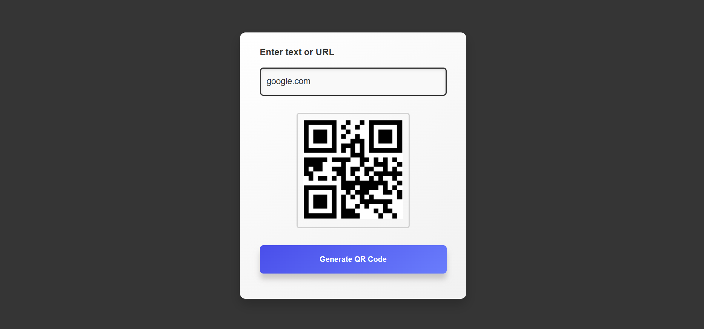

# QR Code Generator

A simple web-based application to generate QR codes from text or URLs. This project allows users to input text or a URL and instantly convert it into a QR code for easy sharing.

---

## Features

- **Real-time QR Code Generation**: Enter text or a URL to create a QR code instantly.
- **Responsive Design**: Fully responsive and user-friendly interface.
- **Error Handling**: Highlights input field when left empty, guiding the user.
- **Smooth Transitions**: Adds aesthetic transitions for better user experience.

---

## Technologies Used

- **HTML**: For the basic structure of the application.
- **CSS**: For styling and creating a visually appealing design.
- **JavaScript**: To handle dynamic QR code generation and error handling.
- **External API**: Uses the [QRServer API](https://goqr.me/api/) to generate QR codes.

---

## Preview

### User Interface:
  

---

## How to Use

1. Clone this repository:
   ```bash
   git clone https://github.com/Vardhan09-web/simple-qr-generator.git
